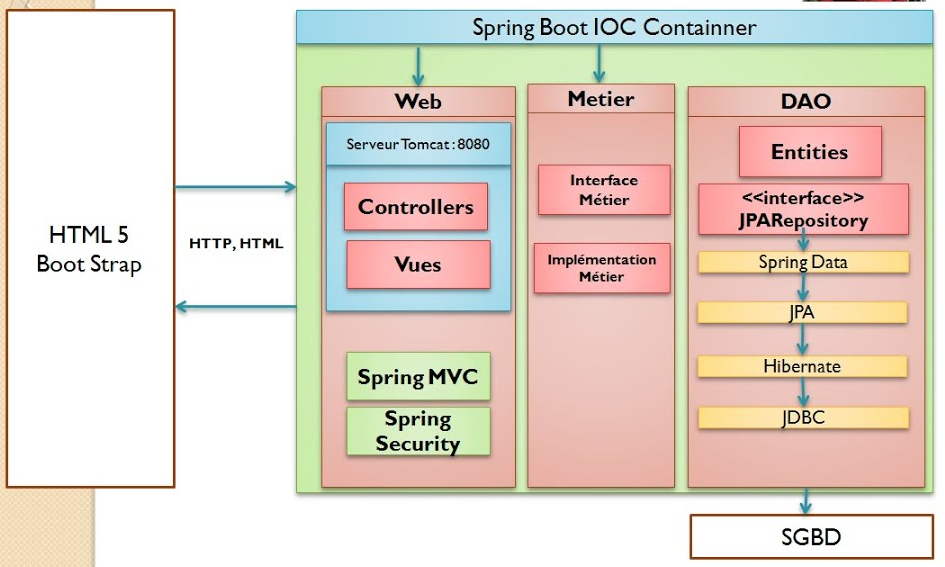
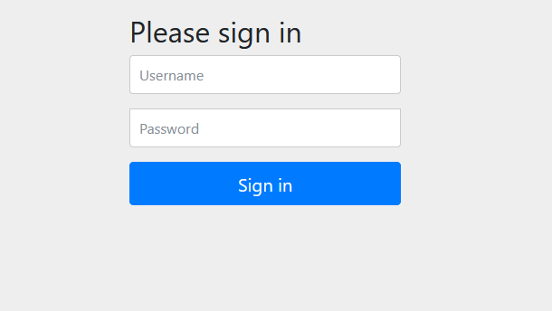

# GestionPatient

<h2>Application web JEE Gestion des patients de l'activité pratique N°3 et N°4 avec ses quatres parties: </h2>
<ul>
<li>Partie 1 : Rechercher les patients, pagination et suppression des patients</li> 

<li>Partie 2 : Page template, Ajout des patients, validation des formulaires, édition et mise à jour des patients</li> 

<li>Partie 3 : Spring Security (Stratégies : InMemoryAuthentication et JDBCAuthentication)</li> 

<li>Partie 4 : Spring Security (Stratégie : UserDetailsService)</li> 

<li>Partie 5: Quelques Améliorations...</li>
</ul>

# Architecture Spring MVC

# Page Login

# Page d'Acceuil

# Page Listes des Patients

Dans cette partie, on peut gérer la liste des patients (Modifier/Editer)

# Page Listes des Medecins

Dans cette partie, on peut gérer la liste des médecins (Modifier/Editer)
