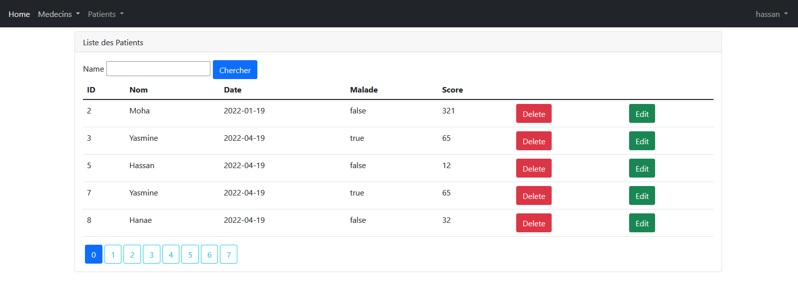

# GestionPatient

<h1>Application web JEE Gestion des patients de l'activité pratique N°3 et N°4 avec ses quatres parties: </h1>
<ul>
<li>Partie 1 : Rechercher les patients, pagination et suppression des patients</li>
<li>Partie 2 : Page template, Ajout des patients, validation des formulaires, édition et mise à jour des patients</li>
<li>Partie 3 : Spring Security (Stratégies : InMemoryAuthentication et JDBCAuthentication)</li>
<li>Partie 4 : Spring Security (Stratégie : UserDetailsService)</li>
<li>Partie 5: Quelques Améliorations...</li>
</ul>

# Acceuil

# Partie Patients

# Partie Medecins

